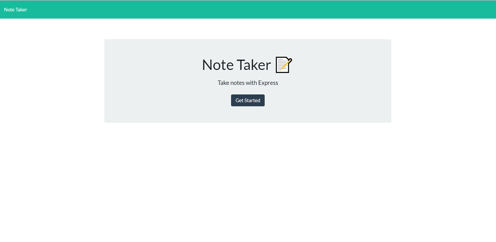

# Note Taker

<h1 align="center">Express Note Taker App 🚀</h1>

<p align="center">
    
    
    
    

</p>
<p align="center">
    
    
    
    
    
</p>

## 📓 Description

A node.js express.js application that uses user input to create, store and delete notes.

#### 

## 🎬 Screenshot



## 🃏 User Story

```
AS A small business owner
I WANT to be able to write and save notes
SO THAT I can organize my thoughts and keep track of tasks I need to complete
```

## ✔️ Accpetance Criteria

```
GIVEN a note-taking application
WHEN I open the Note Taker
THEN I am presented with a landing page with a link to a notes page
WHEN I click on the link to the notes page
THEN I am presented with a page with existing notes listed in the left-hand column, plus empty fields to enter a new note title and the note’s text in the right-hand column
WHEN I enter a new note title and the note’s text
THEN a Save icon appears in the navigation at the top of the page
WHEN I click on the Save icon
THEN the new note I have entered is saved and appears in the left-hand column with the other existing notes
WHEN I click on an existing note in the list in the left-hand column
THEN that note appears in the right-hand column
WHEN I click on the Write icon in the navigation at the top of the page
THEN I am presented with empty fields to enter a new note title and the note’s text in the right-hand column
```

## Table of Contents

- [Description](#description)
- [Screenshot](#Screenshot)
- [User Story](#user-story)
- [Accpetance Criteria](#Accpetance-Criteria)
- [Table of Contents](#Table-of-contents)
- [Installation](#installation)
- [Usage](#usage)
- [License](#license)
- [Contributing](#contributing)
- [Demo](#demo)
- [Questions](#questions)

## Installation

To install necessary dependencies, run the following command:

```
npm init
npm install express nodemon
npm run start
```

## Usage

### 1 Go to application url: https://hb-note-taker.herokuapp.com


### 2 Click the Get Started Button:


### 3 Add new notes, review old notes, delete notes

## Built With Following Languages

- Node.js
- JavaScript
- HTML
- CSS

## Author:

Hugh Bowie IV
